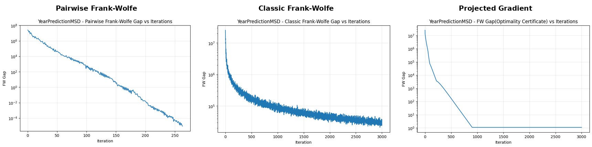

<div align="center">

# Optimization Methods for the LASSO Problem

**A numerical optimization study comparing projection-free and projected first-order methods for sparse regression.**

[](https://www.python.org/)
[](https://jupyter.org/)
[](https://numpy.org/)
[](https://scipy.org/)
[](https://scikit-learn.org/)
[](#academic-context)

[**Explore the notebook**](lasso_optimization_methods.ipynb) · [**Read the full report**](report/optimization_methods_for_lasso_report.pdf) · [**View benchmark data**](results/benchmark_summary.csv)

</div>

---

## Project Snapshot

This project studies the L1-constrained least-squares problem

\[
\min_x \|Ax-b\|_2^2 \quad \text{subject to} \quad \|x\|_1 \le \tau,
\]

and compares three first-order optimization strategies:

- **Classic Frank-Wolfe** — projection-free optimization using a linear minimization oracle.
- **Pairwise Frank-Wolfe** — an active-set variant that transfers weight between atoms to reduce zig-zagging.
- **Projected Gradient** — gradient descent followed by Euclidean projection onto the L1 ball.

The experiments compare convergence, optimality certificates, runtime, and sparsity across datasets ranging from **90 to 150,360 features**.

### Key result

On **YearPredictionMSD**, Pairwise Frank-Wolfe reached the common `1e-5` Frank-Wolfe gap tolerance in **263 iterations** with a recorded runtime of approximately **4.55 s**. In the same notebook run, Classic Frank-Wolfe and Projected Gradient reached their 3,000-iteration limits without meeting that tolerance.

> Runtime values are measurements from the original experimental run and depend on hardware, software versions, and system load. The convergence metrics are the more portable comparison.

<p align="center">
  
</p>

<p align="center"><em>Frank-Wolfe optimality gap on YearPredictionMSD. Lower is better; the y-axis is logarithmic.</em></p>

---

## Benchmark Results

| Dataset | Method | Iterations | Final objective | Final FW gap | Runtime (s) | Non-zero coefficients |
|---|---|---:|---:|---:|---:|---:|
| Riboflavin | Classic Frank-Wolfe | 5,000 | 0.0780 | 1.42e-1 | 1.06 | 104 |
| Riboflavin | **Pairwise Frank-Wolfe** | 5,000 | **0.0262** | **3.43e-2** | **0.67** | **83** |
| Riboflavin | Projected Gradient | 5,000 | 0.4313 | 2.45e+0 | 2.09 | 352 |
| YearPredictionMSD | Classic Frank-Wolfe | 3,000 | 5.1276e+7 | 2.42e+4 | 152.11 | 20 |
| YearPredictionMSD | **Pairwise Frank-Wolfe** | **263** | 5.1261e+7 | **9.04e-6** | **4.55** | 20 |
| YearPredictionMSD | Projected Gradient | 3,000 | 5.1261e+7 | 1.10e+0 | 146.33 | 20 |
| E2006 | Classic Frank-Wolfe | 3,000 | 1734.23 | 2.26e+2 | 275.11 | **380** |
| E2006 | **Pairwise Frank-Wolfe** | 3,000 | **1611.95** | **1.07e+1** | 342.23 | 659 |
| E2006 | Projected Gradient | 3,000 | 1706.56 | 3.37e+3 | **257.81** | 1,694 |

The full raw benchmark table is available as [`results/benchmark_summary.csv`](results/benchmark_summary.csv).

### What the experiments suggest

**Pairwise Frank-Wolfe** produced the lowest final objective and Frank-Wolfe gap on all three datasets in this experimental setup. Its advantage was particularly pronounced on YearPredictionMSD, where it met the stopping criterion in far fewer iterations.

**Classic Frank-Wolfe** preserved sparse iterates and uses a simple projection-free update, but its optimality gap decreased more slowly on the larger problems.

**Projected Gradient** achieved a YearPredictionMSD objective essentially equal to Pairwise Frank-Wolfe, but its FW gap remained above the shared tolerance after 3,000 iterations. On E2006, projection produced a substantially denser coefficient vector.

---

## Datasets

| Dataset | Samples | Features | L1 radius (`tau`) | Why it is useful here |
|---|---:|---:|---:|---|
| Riboflavin | 71 | 4,088 | 3 | Small-sample, high-dimensional regression |
| YearPredictionMSD | 515,345 | 90 | 10 | Large-sample, moderate-dimensional regression |
| E2006 | 16,087 | 150,360 | 3 | Very high-dimensional sparse regression |

The notebook downloads the required data from **OpenML**, the **UCI Machine Learning Repository**, and **LIBSVM** when needed. Large dataset files are intentionally excluded from version control.

---

## Methods at a Glance

### 1. Classic Frank-Wolfe

At every iteration, the method solves a linear minimization problem over the L1 ball and moves toward the selected extreme point. The approach avoids explicit projection and naturally constructs solutions from sparse atoms.

### 2. Pairwise Frank-Wolfe

Pairwise Frank-Wolfe selects both a forward atom and an away atom from the current active set, then transfers mass between them. This mechanism can correct earlier atom choices and often reduces the zig-zagging observed in the classic method.

### 3. Projected Gradient

Projected Gradient performs a gradient step in the unconstrained space and then projects the result back onto the L1 ball. The implementation also evaluates the Frank-Wolfe gap so all three methods can be compared using a common optimality certificate.

---

## What This Project Demonstrates

- implementing optimization algorithms from mathematical definitions;
- working with dense and sparse high-dimensional datasets;
- L1-ball constraints and Euclidean projection;
- Frank-Wolfe linear minimization oracles and active sets;
- convergence diagnostics and stopping criteria;
- numerical benchmarking across different problem geometries;
- scientific Python with NumPy, SciPy, pandas, scikit-learn, and Matplotlib.

---

## Repository Structure

```text
.
├── assets/
│   ├── yearprediction_fw_gap_comparison.png
│   ├── yearprediction_classic_fw_gap.png
│   ├── yearprediction_pairwise_fw_gap.png
│   └── yearprediction_projected_fw_gap.png
├── report/
│   └── optimization_methods_for_lasso_report.pdf
├── results/
│   └── benchmark_summary.csv
├── .gitignore
├── lasso_optimization_methods.ipynb
├── README.md
└── requirements.txt
```

---

## Run the Project

### 1. Clone the repository

```bash
git clone https://github.com/erdemaltun99/lasso-optimization-methods.git
cd lasso-optimization-methods
```

### 2. Create a virtual environment

```bash
python -m venv .venv
```

Activate it on **Windows PowerShell**:

```powershell
.\.venv\Scripts\Activate.ps1
```

Or on **macOS / Linux**:

```bash
source .venv/bin/activate
```

### 3. Install dependencies

```bash
pip install -r requirements.txt
```

### 4. Launch Jupyter

```bash
jupyter notebook lasso_optimization_methods.ipynb
```

> **Compute note:** YearPredictionMSD and E2006 are relatively large. The first run downloads and preprocesses the data locally, and E2006 in particular may require significant memory and runtime.

---

## Team

This was a group project for the University of Padova.

| Contributor | Main implementation |
|---|---|
| **Erdem Altun** | Classic Frank-Wolfe |
| **Berke Kaan Dede** | Pairwise Frank-Wolfe |
| **Andela Ruta Stancu** | Projected Gradient |

The repository presents the full group study while clearly preserving individual contribution attribution.

---

## Academic Context

Completed for **Optimization for Data Science**, **University of Padova**, Academic Year **2025–2026**.

The report and implementations are published for educational and portfolio purposes. No open-source license is included; reuse requires permission from the project authors.
